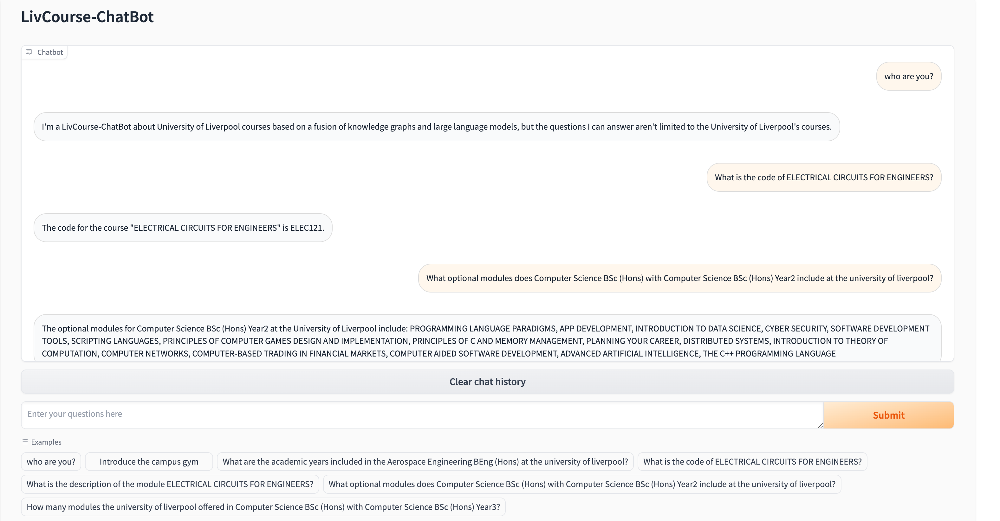
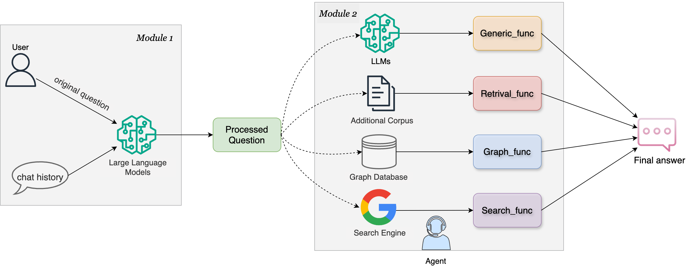

# LivCourse-ChatBot

[**🇨🇳Chinese**](./README.md) | [**🌐English**](./README.md) | [**❓Issues**](https://github.com/XavierXinchi/LivCourse-ChatBot/issues)

<p align="center">
    
    
    
    
</p>

## 📝 Introduction

LivCourse-ChatBot ia a chatbot about the University of Liverpool courses based on a **fusion of knowledge graphs (KG) and large language models (LLMs).** It combines the advantages of LLMs and KGs to answer both generic and domain-specific questions, such as information about course modules at the University of Liverpool.

💡The following image shows the chatbot demo after deployment.



## 💫 Features

- Memory-based: The model can understant the context of the use's questions
- Domain-specific: The model can answer specific questions about the couse information of the University of Liverpool
- Scalable: Developers can add additional personalized corpus for the model learning 

The following image shows the structure of the model:



In the first module, the large language model will combine the user's original question with the historical dialog to produce a processed question.

In the second module, the processed question will be sent to the Agent, which will generate a chain of thoughts to determine which category the question belongs to, and hand it over to the function of the corresponding category to generate the final answer.

- Generic_func: For answering questions in generalized areas of knowledge, such as greetings.
- Retrival_func: For answering questions from additional corpus, e.g. campus gym information in this project.
- Graph_func: For answering questions about the nodes and relationships stored in the graph database [neo4j](https://neo4j.com/?utm_source=Google&utm_medium=PaidSearch&utm_campaign=Evergreenutm_content%3DEMEA-Search-SEMBrand-Evergreen-None-SEM-SEM-NonABM&utm_term=neo4j&utm_adgroup=core-brand&gad_source=1&gclid=CjwKCAiAopuvBhBCEiwAm8jaMXhwJ32kD3nX9mhZ08_5oWgJRYbsGqg8Nw8ele399ED5WMwsB5axgBoCCnsQAvD_BwE), such as University of Liverpool courses, degrees, modules, etc.
- Search_func: For answering questions through a search engine ([Google](https://www.google.com/)) when other functions don\'t generate the correct answers.

## 🛠️ Quick Start

### 1. Install dependencies

Create a virtual conda environment, activate it and install the packages:

   ```shell
   conda create -n LivCourse python=3.9
   conda activate LivCourse
   pip install -r requirements.txt
   ```

### 2. Setup the neo4j graph database

Apply for your OpenAI API key in its [website](https://platform.openai.com/api-keys).

Go to `.env` file, and set your `OPENAI_API_KEY`, `NEO4J_URI`, and `NEO4J_PASSWORD`.

Run the following codes to generate the knowledge graphs in your neo4j database:

```shell
python gen_kg.py
```

### 3. Use LangSmith to monitor the application (Optional)

Go to [LangSmith](https://smith.langchain.com/) website to apply for your API key and create a project called `LivCourse-ChatBot`. Configure environment to connect to LangSmith.

```shell
export LANGCHAIN_TRACING_V2=true
export LANGCHAIN_ENDPOINT="https://api.smith.langchain.com"
export LANGCHAIN_API_KEY="<your langchain smith api>"
export LANGCHAIN_PROJECT="LivCourse-ChatBot"
```

### 4. Run the chatbot demo

```shell
python app.py
```

The file structure is look like this

```shell
.
├── LICENSE
├── README.md
├── __pycache__
│   ├── agent.cpython-39.pyc
│   ├── config.cpython-39.pyc
│   ├── prompt.cpython-39.pyc
│   ├── service.cpython-39.pyc
│   └── utils.cpython-39.pyc
├── agent.py
├── app.py
├── config.py
├── data
│   └── db
│       ├── chroma.sqlite3
│       └── f4e6c6f1-3933-4325-b4d3-51ea2dceec57
│           ├── data_level0.bin
│           ├── header.bin
│           ├── length.bin
│           └── link_lists.bin
├── data_process.py
├── dataset
│   └── dataset.json
├── env.txt
├── gen_kg.py
├── img
│   ├── demo.png
│   ├── diagram.png
│   └── diagram.svg
├── inputs
│   └── gym.txt
├── prompt.py
├── requirements.txt
├── service.py
└── utils.py
```

## ⚠️ Disclaimer

This project-related resources are for academic research only, strictly prohibited for commercial use. When using parts involving third-party code, please strictly follow the corresponding open source agreement. For any content of the model output, this project does not assume any legal responsibility, and does not assume responsibility for any loss that may arise from the use of related resources and output results.

## 🌟 Support

If you like this project, please don't forget to star✨ this repository.
